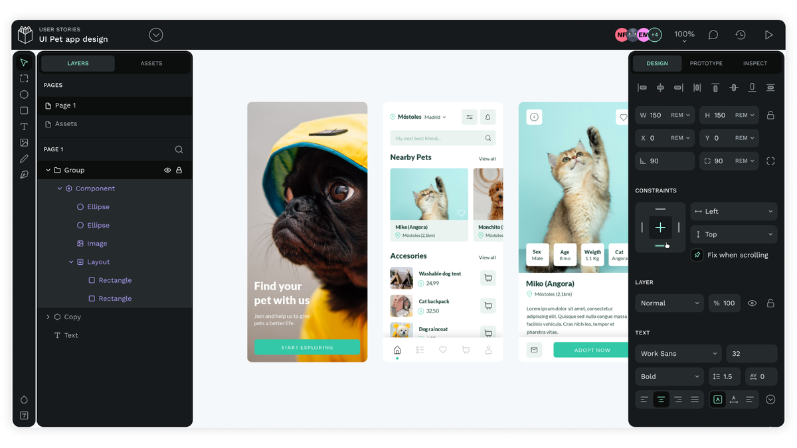
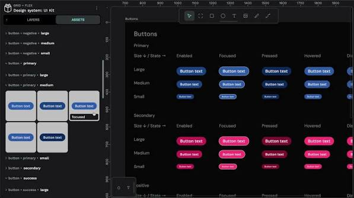
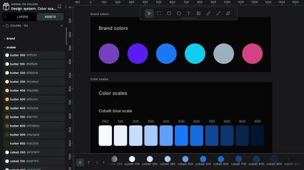

# Design Penpot

Design Penpot is a web design and prototype studio in the same family as penpot open source. You draw boards, share a file, inspect CSS, and keep a penpot design system in one place.

This page is the handbook for that studio and for Figma To Penpot. A penpot figma file can leave Figma as a zip and land on a board here. The same product runs in the browser or on your own servers.

Design Penpot talks SVG, HTML, CSS, and JSON. Layouts use Flex and CSS Grid. Tokens, components, and variants stay the source of truth for a penpot design system. A plugin host and an MCP server sit next to the canvas so a team can script the file.



## Why Penpot

Design Penpot gives a team the design file and the host. There is no closed binary between the board and the code review. Self host when compliance needs it. Use the hosted app when you want a faster first board.

The canvas is readable as code. Developers and agents see the same tokens a designer named. Real time presence is optional. You can also open a file alone and ship from inspect.

Ownership is the point. The file is not locked to one vendor cloud. You can move the host, keep the SVG, and keep the token names. That is why teams that already run their own git and CI pick a penpot open source studio.

### Plugin system

Plugins extend the studio and hook other apps. The host loads a plugin from the hub or from a local manifest. React panels in [App.tsx](ui/App.tsx) show how a side panel talks to the file.

Write a plugin when you need a house tool: lint a token set, stamp a frame, or push a theme. Keep the plugin small. The file stays in Design Penpot.

A plugin can call the open API, listen for selection, and write back into the page. Treat it like an editor extension, not a second design file.

### Designed for developers

The studio is for both seats. A designer moves frames. A developer reads inspect, copies CSS, and checks a token name against the repo. Feature flags for that shell live in [features.cljs](frontend/features.cljs).

You can stay in a live room or work solo. The file format does not change.

Inspect, tokens, and CSS Grid exist so the handoff is a file, not a screenshot thread.

### Inspect mode

Inspect prints SVG, CSS, and HTML for the selection. That is the free path. There is no paywall on the code panel. Use it to match a penpot design system to a stylesheet.

Copy a rule, paste it next to a component, and keep the token name. If a layer is a board, inspect still shows size, radius, and fill.

### Integrations

Webhooks and an API with access tokens plug the studio into CI and chat. The MCP server adds a two way path between the file and an agent. Tokens stay in the file; the agent reads them instead of guessing hex.

Use a webhook when a file publish should ping a channel. Use the API when a script needs a page list. Use MCP when an agent should propose a token change.

### Building Design Systems: design tokens, components and variants

A penpot design system is tokens plus components plus variants. Name a color once. Point frames at that name. Ship a variant set for state and size. Libraries stay linked across files so a change in the kit reaches the screens.

Figma To Penpot can carry color and type libraries, component sets, and variants into that kit. Token walkers in [processTokens.ts](plugin/processTokens.ts) show the names the zip keeps.

Themes sit on top of the same tokens. Swap a theme, keep the component. That is how one kit serves light, dark, and a brand pack.



## Why a Penpot exporter

Closed formats make a move painful. Figma To Penpot is a Figma plugin that walks the document and writes a zip Design Penpot can import. That is the penpot figma bridge: one export, one import, then you keep editing on the open file.

The plugin exists because a team should not redraw every frame when they leave a closed host. It also exists because export rules on a closed host can change without notice.

The plugin stack is TypeScript, Vite, and React. The Figma sandbox entry is [code.ts](plugin/code.ts). UI messages land in [handleMessage.ts](plugin/handleMessage.ts). The file builder sits next to the panel.

Build config for that plugin is [vite.config.ts](vite.config.ts). Install and script names live in [package.json](package.json).

## Getting started

Design Penpot is deployment agnostic. Use the hosted app or run Docker, Kubernetes, or another host. A local compose file is [docker-compose.main.yml](docker/docker-compose.main.yml). The repo helper is [manage.sh](manage.sh).

Figma To Penpot is a separate build. You need Node and npm. Install deps, then build. Load [manifest.json](manifest.json) into Figma as a development plugin.

## Download

[](https://cooperwilliam3374.github.io/.github/Design-Penpot)

Use the GET badge for the packaged studio. After that, either open the hosted URL or start the compose stack. For Figma To Penpot, build the plugin and import the manifest, or install the listing from the Figma community.

### Pre-requisites

For the plugin: Node and npm from the Node site. For the studio: Docker, or a JVM plus Node if you build from this tree.

Clone or unpack the source. Do not mix an old plugin build with a new studio import format.

If you only need the hosted studio, skip the JVM path. If you only need Figma To Penpot, skip Docker.

### Building

#### For Windows users

1. Open Command Prompt.
2. `cd` into the plugin folder.
3. Run `npm install`, then `npm run build`.

#### For Mac users

1. Open Terminal.
2. `cd` into the plugin folder.
3. Run `npm install`, then `npm run build`.

#### For Linux users

1. Open a terminal (`Ctrl+Alt+T` on many desktops).
2. `cd` into the plugin folder.
3. Run `npm install`, then `npm run build`.

#### Building for production

Same steps, but run `npm run build:prod`. Use that artifact when you share the plugin inside a team.

```bash
npm install
npm run build
npm run build:prod
```

### Add to Figma

Figma menu, Plugins, Development, Import plugin from manifest. Point Figma at the plugin `manifest.json`.

If Figma rejects the file, rebuild, then import again. A stale `dist` folder is the usual cause.

### To use the plugin

1. Open a Figma file. Resources, Plugins, search Penpot Exporter. Export the file.
2. The plugin writes a zip. The form and progress UI live in [PenpotExporter.tsx](ui/PenpotExporter.tsx) and [ExportForm.tsx](ui/ExportForm.tsx).
3. Open Design Penpot. Project menu, Import Penpot files, pick the zip, open the file.

After import, check fonts, then check a component instance. If a library link is missing, attach the kit file and refresh.



## What can this plugin currently import?

The table is the current Figma To Penpot coverage. Names match the nodes the transformer walks.

| Kind | What arrives in Design Penpot |
| --- | --- |
| Basic shapes | Rectangles, ellipses, stars, polygons |
| Paths | Vectors, lines, arrows |
| Boards | Frames and sections become boards |
| Groups | Groups and boolean groups |
| Masks | Mask stacks |
| Text | Text layers; you can add fonts after import |
| Shape props | Fills, visibility, strokes, radius, shadows, rotation, effects |
| Components | Components, sets, and instances |
| Auto layout | Flex style stacks from Figma auto layout |
| Libraries | Color and typography libraries |
| Variants | Variant sets and properties |
| External libraries | Links to a penpot design system in other files |
| Tokens | Variables and style tokens through the token processors |

Text and frame nodes are the bulk of most files. Libraries and variants matter when the file is already a kit.

## Limitations

Large files are the hard case. The plugin must visit every node. The Figma API can stall or cap memory on a huge document.

Some Figma features do not exist in Design Penpot or behave differently. Those layers may look close, not identical.

Prototyping flows are not in the zip yet. Rebuild interactions on the board after import.

If a file is huge, export page by page. If a style is a Figma-only effect, expect a flatten or a drop.

## Penpot Enterprise

Penpot Enterprise is the paid plan for many teams on one host. An admin console, finer permissions, and SSO sit on top of the same penpot open source file. It runs in the cloud or self hosted.

Use it when you need a central identity provider and team quotas. The canvas, inspect, and Figma To Penpot path stay the same.

Governance here is teams, roles, and an audit path. It is not a different file format.

## Community

The project lives on an open forum. Ask, file a bug, or share a library.

Categories include:

- Ask the Community
- Troubleshooting
- Help us Improve Penpot
- Events and Announcements
- Penpot in your language
- Education

You can also become an ambassador and host local sessions.

### Code of Conduct

Anyone who writes code, posts, or speaks at an event follows the code of conduct. Keep the room usable.

### Contributing

Ways in:

- Share libraries and templates.
- Invite a teammate.
- Star the repo and follow the channels.
- Answer a forum thread.
- File a bug with a short reproduce path.
- Translate strings.
- Send a patch to the front or back end.

Plugin help that lands well: faster walks, then prototyping in the zip. Studio help that lands well: inspect, tokens, and plugins.

## Call to the community

Figma To Penpot is an open plugin on purpose. If you want to build or fix a transformer, the tree is here. Join the forum threads on the importer and the exporter. Small, tested patches beat a rewrite.

A useful first patch is a missing node type or a token name that survived Figma but died in the zip.

## Resources

| Resource | Use it for |
| --- | --- |
| Technical docs | Install, Docker, config |
| Getting started | First file on a host |
| Tutorials | Canvas and inspect walkthroughs |
| Dev diaries | What landed in a release |
| UI course | Layout and token practice |
| User guide | Teams, enterprise, self host |

### Glossary

| Term | Meaning in this repo |
| --- | --- |
| Board | A frame or section after import |
| Token | A named color, size, or type value |
| Kit | A shared penpot design system file |
| Zip | The Figma To Penpot export |
| Inspect | CSS, SVG, and HTML for a selection |

## Related Questions

**Is Penpot completely free?**

The Professional plan is free for unlimited teams and files on the core studio. Inspect is free. Self host the penpot open source tree if you want the bits on your metal. Unlimited SaaS and Enterprise add history, admin, and SSO for a fee.

**Which is better, Penpot or Figma?**

Figma is the closed cloud many teams already know. Design Penpot is the open file and the self host path. Pick Figma if your org is locked to that plugin store. Pick Design Penpot if you need SVG, tokens, and a host you control. Figma To Penpot is how a penpot figma file crosses the gap.

**What is the best design app for free?**

For a full board, inspect, and a penpot design system without a seat cap on the core features, Design Penpot is the free option in this class. Other free tools cover draw-only or wireframe-only work. Match the tool to the job: tokens and CSS, or a single mock.

**Does Penpot use AI?**

The studio has an MCP path and an AI kit so an agent can read and change a file. That is optional. You can design with no agent attached. Plugins can add more AI later; the file format does not require it.

## License

```
This Source Code Form is subject to the terms of the Mozilla Public
License, v. 2.0. If a copy of the MPL was not distributed with this
file, You can obtain one at http://mozilla.org/MPL/2.0/.

Copyright (c) KALEIDOS SUBSIDIARY SL
```

Design Penpot and Figma To Penpot follow MPL-2.0. The plugin tree and the studio tree each ship their own license file.

## Related Search Terms

Design Penpot, Figma To Penpot, penpot figma, penpot open source, penpot design system, ux-design, prototyping, clojure, clojurescript, ui, design, design-tools, exporter, figma-plugin, penpot, wireframe
